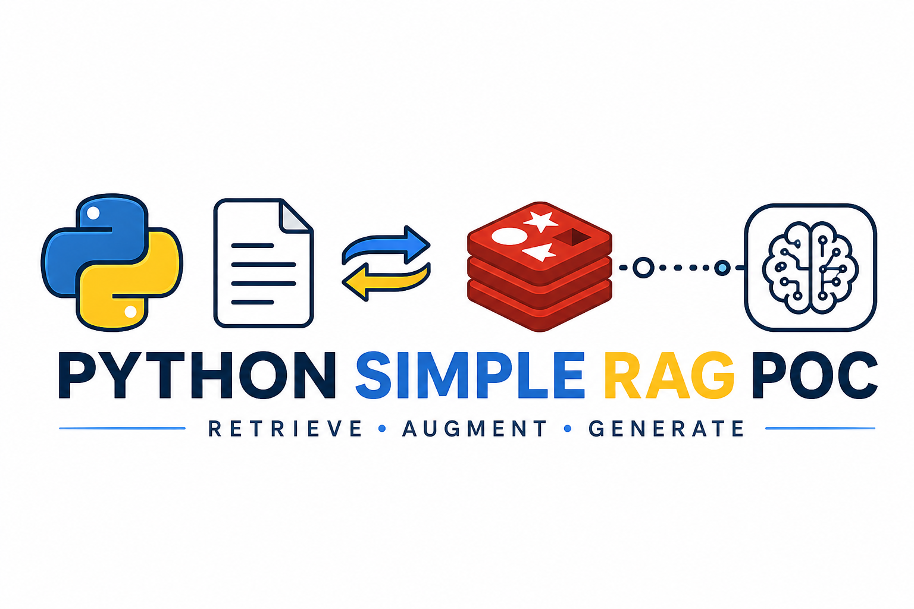

<p align="center">
  
</p>

# Python Simple RAG PoC

A minimal, end-to-end **Retrieval-Augmented Generation (RAG)** proof of concept —
built to be as cheap and transparent as possible. It grounds a large language
model in *your own* documents, so answers are accurate, **source-cited**, and
honest about what they don't know (instead of hallucinating).

Point it at a folder of `.txt` / `.md` / `.pdf` files and it will chunk them,
embed them locally with `bge-small`, and store the vectors in Redis. (PDFs are
converted to Markdown on the way in — see [PDF support](#pdf-support).) When you ask a
question, it retrieves the most relevant passages and feeds them to **Llama 3.1**
(via Groq's free tier) under strict "answer only from the provided context"
rules. Everything runs on your machine except the final LLM call — no paid
services, and the only key you need is a free Groq token.

**Highlights:**

- **Hybrid retrieval** — BM25 full-text + vector similarity, blended.
- **Off-topic guard** — a distance threshold short-circuits questions the
  corpus can't answer, so the model never guesses.
- **Grounded & cited** — every answer points back to the source file it used.
- **Web UI** — a clean light chat interface with live per-phase pipeline
  timings, plus CLI tools for querying and debugging retrieval.
- **Pluggable LLM** — swap Groq for a local Ollama model by editing one file;
  embeddings, chunking, and storage stay the same.

# Recent Activities


## Quickstart (how to run)

```bash
# 1. virtualenv
python3 -m venv .venv
source .venv/bin/activate

# 2. dependencies
pip install -r requirements.txt

# 3. Groq API key (free, from https://console.groq.com)
cp .env.example .env       # then edit .env and set GROQ_API_KEY=...

# 4. start Redis Stack (host port 6380; 6379 is often used by other projects)
docker compose up -d

# 5. ingest the docs in data/
python -m src.ingest

# 6. ask a question (CLI)
python -m src.query "What vector index types does Redis support?"

# 7. or launch the web UI
python -m src.app
# then open http://localhost:5555
```

An out-of-corpus question returns: `I don't have enough information to answer that.`
Put your own `.txt` / `.md` / `.pdf` files in `data/` and re-run `python -m src.ingest`.

## Usage

After ingesting (`python -m src.ingest`), there are four ways to query:

### 1. Web UI (recommended)

```bash
python -m src.app
```

Opens a light-themed web interface at **http://localhost:5555** (port configurable
in `src/config.py`). Type questions, see answers with source citations and
expandable context chunks, filter by source file, re-ingest docs, and check
index status — all from the browser.

### 2. Ask a question (full RAG answer)

```bash
python -m src.query "What flavors does RainbowCandy have?"
```

Embeds the question → retrieves the closest chunks → sends them to the LLM →
returns a concise, **source-cited** answer. Off-topic questions return
`I don't have enough information to answer that.`

### 3. Inspect raw retrieval (no LLM)

```bash
python -m src.query_raw "What flavors does RainbowCandy have?"
```

Shows exactly what Redis returns — each hit's **distance, source, chunk_index,
and full text**, marked `KEEP`/`drop` against the distance threshold. Needs no
Groq key. Use it to debug retrieval and tune `TOP_K` / `MAX_DISTANCE` in
`src/config.py`.

### 4. Filter by source (metadata filtering)

```bash
# restrict the search to a single document (vector similarity + tag filter)
python -m src.query     "what is sold?" --source rainbowcandy.md
python -m src.query_raw "what is sold?" --source indo-trader-sales.md
```

The `--source` flag works on both `query` and `query_raw`. In the web UI, use
the source filter input below the question box. It combines vector similarity
with a `source` tag filter, so only chunks from that file are considered.
Run `python -m src.query --help` to see all CLI options.

### 5. Browse the indexed data (web UI)

Open **http://localhost:5555/data** to see every chunk currently in the index,
grouped by source file (with chunk indexes and full text). Useful for confirming
what was ingested and how documents were split.

## Managing the corpus

- **Add documents:** drop `.txt` / `.md` / `.pdf` files into `data/` and re-run
  `python -m src.ingest` (or click re-ingest in the web UI). Ingestion rebuilds
  the index from scratch each run, so there are no stale chunks or duplicates.
- **Exclude a file without deleting it:** prefix its filename with `exclude-`
  (configurable via `EXCLUDE_PREFIX` in `config.py`). Ingestion skips any file
  whose name starts with that prefix and prints a `[SKIP]` line — handy for
  parking documents you don't want retrieved yet.

## PDF support

Upload a PDF in the web UI (or drop one into `data/`) and it is converted to
Markdown before anything else happens. `report.pdf` becomes `report.md`, and it
is that Markdown file — not the PDF — that gets chunked, embedded and cited, so
you can open `/data` and read exactly what the model sees. The original PDF stays
in `data/` alongside it; re-converting is automatic whenever the PDF is newer
than its `.md`.

Conversion uses [`pymupdf4llm`](https://pymupdf.readthedocs.io/), which rebuilds
headings, lists and tables rather than dumping a flat blob of text — that
structure is what the chunker splits on, so it directly improves retrieval.

**One thing worth knowing.** `pymupdf4llm` has two extraction engines: an ML
layout model and a classic font-size heuristic. Testing both across a pile of
real-world PDFs showed that *each one silently drops text on documents the other
handles perfectly* — the layout model lost 17% of the words in one form, and the
heuristic lost 39% of a multi-column menu. Nothing errors; the text just
disappears, which in a RAG system means a fact becomes permanently unretrievable
while the index looks completely healthy.

So `src/pdf.py` runs **both** engines, counts how many of the PDF's words survived
each, and keeps the better one — falling back to raw text extraction if both
mangle the document. Structure is nice to have; not losing your content is the
requirement. If a conversion does lose text, it says so on the console.


## Source files (`src/`)

Each module has a single responsibility. The two **entry points** you need to run are
`ingest.py` and `query.py`; everything else is a library they compose.

| File | What it's about |
|------|-----------------|
| `config.py` | Central configuration. All tunables live here - embedding model & dimension, the bge query prefix, chunk size/overlap, Redis URL & index name, the retrieval `TOP_K` and distance threshold, and the Groq model. Every other module imports its settings from this file, so you change behavior in one place. |
| `chunking.py` | Splits a document's text into overlapping chunks with a recursive character splitter (breaks on paragraphs → sentences → words). Chunks are sized to stay under the embedder's token limit. Exposes `chunk_text(text) -> list[str]`. |
| `embeddings.py` | Turns text into 384-dim vectors using the local `bge-small` model. Handles bge's query/document asymmetry: `embed_documents()` embeds chunks with **no prefix**; `embed_query()` prepends the query prefix. Both return normalized vectors. Same model for indexing and querying. |
| `store.py` | The Redis store (via `redisvl`). Defines the index schema and provides `create_index()` (build/reset the index), `add_chunks()` (store vectors + text + metadata, converting floats to bytes), `fetch_all()` (list every chunk, for the data browser), and `search()`. `search()` dispatches on `SEARCH_MODE`: pure `vector_search()` (KNN, returns `vector_distance`) or `hybrid_search()` (BM25 text + vector blended in Python). This is the retrieval layer. |
| `generate.py` | The LLM backend (generation step). Builds the grounded system prompt and sends context + question to Groq (`llama-3.1-8b-instant`) via `generate(user_prompt)  str`. Written as a **pluggable** backend - swapping to a local model later means changing only this file. |
| `pdf.py` | Converts an uploaded `.pdf` into a `.md` in `data/` so the rest of the pipeline only ever deals with text. Runs both of `pymupdf4llm`'s extraction engines, scores each on how many of the PDF's words it preserved, and keeps the winner — with a plain-text fallback if both drop content. See [PDF support](#pdf-support). |
| `ingest.py` | **Entry point** for the indexing phase. Loads every `.txt`/`.md` in `data/` (converting any `.pdf` to Markdown first), chunks → embeds → stores them in Redis. Run with `python -m src.ingest`. |
| `query.py` | **Entry point** for the query phase. Embeds the question, retrieves the closest chunks (hybrid BM25+vector when `SEARCH_MODE="hybrid"`), applies the distance threshold, builds the grounded prompt, and returns the answer. Run with `python -m src.query "..."`. Optional `--source <file>` restricts retrieval to one source file (metadata filtering). |
| `query_raw.py` | **Entry point (debug)** for retrieval only — no LLM. Embeds the question, runs the KNN search, and prints each raw hit (distance, source, chunk_index, full chunk text) marked `KEEP`/`drop` against the distance threshold. Needs no Groq key. Useful for inspecting retrieval and tuning `TOP_K` / `MAX_DISTANCE`. Run with `python -m src.query_raw "..."`. Also supports `--source <file>`. |
| `app.py` | **Entry point** for the web UI. Flask app serving a light-themed chat interface at `http://localhost:5555` (port configured in `config.py`). Routes: `/` (chat page), `/data` (browse every ingested chunk grouped by source). APIs: `/api/query` (POST — RAG query, also returns the exact system+user prompt sent to the LLM), `/api/data` (GET — all chunks by source), `/api/ingest` (POST — re-ingest docs), `/api/status` (GET — index health). Run with `python -m src.app`. |
| `__init__.py` | Empty file that marks `src/` as a Python package (so `python -m src.ingest` works). |

**Flow:** `ingest.py` uses `chunking` + `embeddings` + `store`; `query.py` uses
`embeddings` + `store` + `generate`; all of them read from `config`.

## Tech Stack
- **Web UI:** Flask (light-themed chat interface at `localhost:5555`)
- Vector Store: Redis Stack (redisvl + redis-py) via Docker; FLAT index, COSINE distance
- Retrieval: hybrid by default — BM25 full-text + vector KNN, blended (`SEARCH_MODE`, `HYBRID_ALPHA` in `config.py`)
- Embeddings: Local sentence-transformer (currently `BAAI/bge-small-en-v1.5`, **384 dimensions**, strong retrieval quality, ~130 MB)
    - Alternative: `all-MiniLM-L6-v2` — also 384 dimensions, classic lightweight baseline, very fast
- LLM (generation): `llama-3.1-8b-instant` via Groq (free tier) - pluggable backend
- Orchestration: Plain python first; then add LangChain/Llamaindex only if we want abstraction

## The minimal flow in one picture

  INDEX:  docs ─► chunk ─► embed ─► Redis (FLAT index: vector + text + metadata)

  QUERY:  question ─► embed ─► Redis hybrid (BM25 + vector KNN, top-k) ─► prompt(context + question)
                                                         │
                                                         ▼
                                                  LLM (generation) ─► grounded answer

## How the architecture works

### Phase 1 - Indexing (offline, done once / on update):
  
  Documents → Chunk into pieces → Embed each chunk → Store vectors + text in a DB

  1. Load your source docs (PDFs, markdown, DB rows, etc.).
  2. Chunk them into small pieces (e.g. 300–800 tokens). Chunking matters a lot - too big and retrieval is noisy, too small and you lose context.
  3. Embed each chunk: an embedding model turns text into a vector (a list of floats) that captures meaning.
  4. Store each vector alongside its original text and metadata in a vector store.

### Phase 2 - Retrieval + Generation (online, per user question):

  Question → Embed → Vector search (top-k similar chunks) → Build prompt → LLM → Answer

  1. Embed the question with the same embedding model.
  2. Search the vector store for the k most similar chunks (cosine / dot-product similarity).
  3. Assemble a prompt: system instructions + the retrieved chunks as context + the user's question.
  4. Generate the answer with an LLM, instructing it to answer only from the provided context and cite sources.

## Why REDIS?

  Redis Stack (or Redis 8+) ships the vector search capability via the search module.
  
  Concretely Redis gives us:

  - Vector storage + ANN search - store embeddings in hashes or JSON, create an index with HNSW or FLAT, and run
  K-nearest-neighbor queries. This is the core of the retrieval step.
  - Metadata filtering - combine vector similarity with tag/numeric filters (e.g. "only docs from 2024").
  - Hybrid search - full-text (BM25) + vector in one query.
  - Caching - Redis's original strength. Two useful layers: a semantic cache (return a stored answer when a new
  question is semantically near a previous one) and an embedding cache (avoid re-embedding identical text).
  - Speed - in-memory, very low latency.

  The official redis Python client plus redisvl (Redis Vector Library) make this ergonomic.

  Trade-off to know: Redis holds vectors in RAM, so for very large corpora (tens of millions of chunks) memory cost
  is the main consideration. For a POC or small/medium production set, it's excellent.

## Why Groq (for the LLM / generation step)?

The goal was the **cheapest** setup with **no credit card**. The generation step
needs a programmatic API the app can call - and that ruled out the obvious
options:

  - A **Claude Pro** subscription and an **OpenCode** subscription are interactive
    tools; neither exposes an API key a backend can call.
  - **Google AI Studio (Gemini)** free tier returned `limit: 0` - the free tier
    isn't available in my region without enabling billing (a credit card).

**Groq** fit every constraint:

  - **Free tier, no credit card** - you just need to create an API key at console.groq.com. Super easy, instant use haha.
  - **Hosted** - no local compute spent on generation (embeddings already run
    locally on the Mac; offloading the LLM keeps RAM free).
  - **Fast** - Groq runs models on its LPU hardware, so responses are very low
    latency, which makes the POC feel snappy.
  - **OpenAI-compatible API** via the official `groq` Python SDK - simple to call,
    easy to swap.

  Trade-offs: as a hosted service your context leaves the machine (use a
  non-sensitive corpus, or switch to a local model for privacy), and the free tier
  is rate-limited (its fine for PoC purpose, and actually the free tier limit is already A LOT).

## Why `llama-3.1-8b-instant`?

  - **Small, fast, cheap** - an 8B instruction-tuned model matches the "cheapest /
    lightest" goal and returns answers quickly.
  - **Good enough for RAG** - in a RAG pipeline the model's job is narrow: read the
    retrieved chunks and synthesize a grounded answer. The hard part (finding the
    right text) is done by retrieval, so a small instruct model performs well; you
    don't need a frontier model to answer from supplied context.
  - **Available and stable on Groq** - I was originally wanted a Gemma model, but Groq
    decommissioned `gemma2-9b-it`. Listing the account's live models showed
    `llama-3.1-8b-instant` as a small, current, well-supported option, so I use it.
  - **Pluggable** - generation lives entirely in `src/generate.py` behind a single
    `generate()` function. Swapping models (or moving to a local model like Ollama
    + Gemma) means changing only that file and the `GEN_MODEL` value in
    `src/config.py`; the rest of the pipeline is unaffected.

  To change the model, update `GEN_MODEL` in `src/config.py`. Current Groq model
  IDs are listed at https://console.groq.com/docs/models (they change over time as
  models are added or retired).

## Technical Details

### Chunking Strategies

Chosen:
- Recursive splitting: Splits on a hierarchy of separators. Try to break on paragraph first; if a piece is still too big, then break on sentences; then on words. Keep natural units together while respecting our size cap.
- Chunk size: ~400 tokens per chunk, ~60 tokens overlap (~15%)

Other strategies not used: 
- Fixed size (every N character / tokens): Cut mid sentence / mid word, crude
- Sentence-based: Sentence may vary wildly in length, chunk size get uneven.
- Structure-aware: split on document structure. Worth if want to ingest markdown.
- Semantic chunking: use embeddings to detect topic shifts and cut there. Highest quality but overkill for a PoC

Metadata to store with each chunk:
- source: filename / URL (so we can cite it in the answer)
- chunk_index: position within the document (lets us fetch neighbors later)
- title / section: if available (improves filtering and citations)

Notes
- Retrieval can only even return chunks we created. If a question's answer is split across two badly-cut chunks, no amount of LLM quality will fix it (the model never sees the whole answer)

How a chunk is stored
- Each chunk become one Redis key holding several fields (because Redis isn't natively a 'vector DB')
    - embedding   = <384 float32 values, stored as bytes>
    - content     = "The revenue grew 20% in Q4 ..."
    - source      = "annual_report_2025.pdf"
    - chunk_index = 42
- Format: HASH (flat fields, most memory-efficient)
- The index: FT.CREATE
    - We define an index once that tells Redis which field exists and how to search them
    - The vector field is the important one.
    - Conceptually (this is only an example for understanding, not as deliverable):
        - FT.CREATE chunk_idx
            ON HASH PREFIX 1 chunk:
            SCHEMA
              embedding    VECTOR FLAT 6 TYPE FLOAT32 DIM 384 DISTANCE_METRIC COSINE
              content      TEXT
              source       TAG
              chunk_index  NUMERIC
        - Why FLAT?
            - For PoC purpose, thousands of chunks on Macbook laptop would be an instant, gives exact result, and zero tuning.
            - Accuracy: Exact (always the true top-k)
            - Memory usage: lower than HNSW
            - Speed: Slower as data grows
        - Why COSINE as DISTANCE_METRIC (how 'similarity' is measured between two vectors')?
            - COSINE: angle between vectors (ignores magnitude). Our bge-small produces small embeddings, and cosine is the metric these models are trained and benchmarked on. This is the safe, standard match.
            - IP: inner product / dot product
            - L2: Euclidean distabce 
        - DIM 384: must match bge-small output, otherwise index cration or insert fail

# Changes

## Before: Pure Vector Search

1. Embed the question with bge-small
2. Find the 5 closest chunks by cosine distance (vector similarity only)
3. Filter out anything with distance > `MAX_DISTANCE` (0.40 — tuned so off-topic queries short-circuit to "I don't have enough information")
4. Send surviving chunks to the LLM

Weakness: If the user's wording differs from the chunk's wording, the vector may miss it. e.g. asking "RDBMS analogy" might not vector-match a chunk that uses words like "row" and "column" without ever saying "RDBMS".

## After: Hybrid Search (BM25 + Vector)

1. Run two searches in parallel:
- BM25 text search — classic keyword search on the content field. Finds exact word matches like "RDBMS", "row", "index". Returns top 15 chunks ranked by text relevance score.
- Vector KNN search — same as before, returns top 15 chunks by cosine similarity.
2. Normalize both score sets to 0–1 range (so text scores and vector scores are comparable).
3. Combine with weighted linear blend:
final_score = 0.7 × vector_score + 0.3 × text_score
(HYBRID_ALPHA = 0.7 — mostly vector, with a text boost)
4. Sort by combined score, take top 5, send to LLM.
Why it's better: A chunk that ranks #8 on vector alone might rank #1 on BM25 keywords. The blend surfaces it. Pure vector search would have missed it entirely since it only looked at the top 5.
